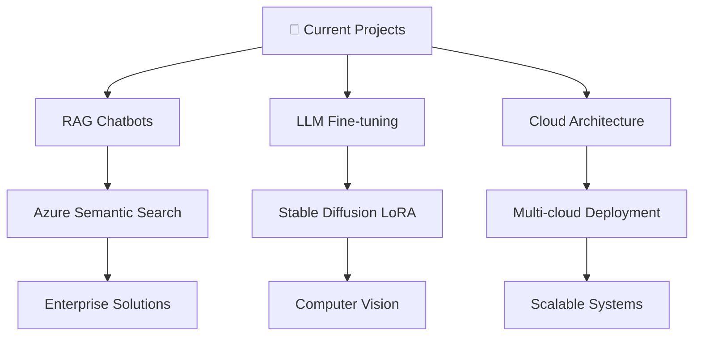

#  Hey there! I'm Abdul Moiz

<div align="center">
  
</div>

<div align="center">
  
  
</div>

---

## 🚀 About Me

```python
class BackendDeveloper:
    def __init__(self):
        self.name = "Abdul Moiz"
        self.role = "Associate Software Engineer @ Funavry Technologies"
        self.location = "Islamabad, Pakistan 🇵🇰"
        self.education = "AI Graduate from Air University"
        self.current_focus = ["RAG Chatbots", "LLM Fine-tuning", "Cloud Architecture"]
        self.fun_fact = "I reduce support tickets by 40% with AI magic ✨"
    
    def get_skills(self):
        return {
            "backend": ["FastAPI", "MySQL", "MongoDB", "RESTful APIs"],
            "ai_ml": ["RAG", "LLMs", "Stable Diffusion", "GPT-4", "Computer Vision"],
            "cloud": ["Azure", "AWS", "GCP", "Nginx", "Docker"],
            "languages": ["Python", "Dart", "JavaScript", "SQL"],
            "mobile": ["Flutter", "Firebase", "Cross-platform"]
        }
    
    def current_projects(self):
        return [
            "🤖 Enterprise RAG Chatbots with Azure Semantic Search",
            "📊 AI-powered Agricultural Insights Platform",
            "🏥 Medical AI Assistant (AidrBot)",
            "📋 Automated OCR Form Processing System"
        ]

developer = BackendDeveloper()
print(f"Hello World! I'm {developer.name} 👨‍💻")
```

---

## 🛠️ Tech Arsenal

<div align="center">

### Backend & Databases


### AI & Machine Learning


### Cloud & DevOps


### Languages & Tools


</div>

---

## 💼 Professional Experience

<div align="center">
  <table>
    <tr>
      <td width="33%">
        <div align="center">
          
          <h3>🚀 Funavry Technologies</h3>
          <p><strong>May 2024 - Present</strong></p>
          <ul align="left">
            <li>🤖 Fine-tuned Stable Diffusion & LLMs using LoRA optimization</li>
            <li>🏗️ Built full-stack backend systems with FastAPI + MySQL</li>
            <li>🔍 Developed RAG chatbots with Azure Semantic Search</li>
            <li>☁️ Deployed services on Azure, GCP, and AWS VMs</li>
            <li>🎯 Specialized in prompt engineering & API integrations</li>
          </ul>
        </div>
      </td>
      <td width="33%">
        <div align="center">
          
          <h3>📱 Freelance (Remote)</h3>
          <p><strong>Sep 2022 - Present</strong></p>
          <ul align="left">
            <li>📲 Designed cross-platform mobile apps for iOS & Android</li>
            <li>🔥 Expertise in Dart, Firebase, and third-party APIs</li>
            <li>🤖 Integrated AI features into mobile applications</li>
            <li>⚡ Optimized app architecture and performance</li>
            <li>🎨 Delivered scalable mobile solutions</li>
          </ul>
        </div>
      </td>
      <td width="33%">
        <div align="center">
          
          <h3>🧠 Multiple Companies</h3>
          <p><strong>Aug 2023 - Sep 2023</strong></p>
          <ul align="left">
            <li>🐍 Utilized Python & Selenium for web scraping</li>
            <li>🎯 Performed advanced prompt engineering</li>
            <li>🤗 Fine-tuned Hugging Face models</li>
            <li>💡 Implemented AI solutions for admin teams</li>
            <li>📊 Delivered tailored AI-driven strategies</li>
          </ul>
        </div>
      </td>
    </tr>
  </table>
</div>

<div align="center">
  <table>
    <tr>
      <td width="50%">
        <div align="center">
          
          <h3>📈 Supreme Solutions</h3>
          <p><strong>Nov 2022 - Dec 2022</strong></p>
          <ul align="left">
            <li>📊 Created custom Pine Scripts for trading clients</li>
            <li>🎯 Delivered tailored trading strategies</li>
            <li>📈 Built technical analysis tools</li>
            <li>⚡ Met specific client requirements</li>
          </ul>
        </div>
      </td>
      <td width="50%">
        <div align="center">
          
          <h3>🎓 Air University, Islamabad</h3>
          <p><strong>Graduated 2024</strong></p>
          <ul align="left">
            <li>🤖 Bachelor's in Artificial Intelligence</li>
            <li>🏆 Specialized in ML & Deep Learning</li>
            <li>📚 Strong foundation in AI algorithms</li>
            <li>🔬 Research in computer vision & NLP</li>
          </ul>
        </div>
      </td>
    </tr>
  </table>
</div>

---

## 🏆 Featured Projects

<div align="center">
  <table>
    <tr>
      <td width="50%">
        <h3 align="center">🤖 Enterprise RAG Chatbots</h3>
        <div align="center">
          
          
          
          <br><br>
          <p><strong>🎯 Impact:</strong> Reduced query latency & improved semantic search relevance</p>
          <p><strong>🔧 Tech:</strong> Azure Semantic Search, Hybrid Vector Search, GPT-4</p>
          <p><strong>✨ Achievement:</strong> Enterprise-grade document retrieval system</p>
        </div>
      </td>
      <td width="50%">
        <h3 align="center">🏥 AidrBot Medical Assistant</h3>
        <div align="center">
          
          
          
          <br><br>
          <p><strong>🎯 Impact:</strong> AI-powered medical diagnosis & report generation</p>
          <p><strong>🔧 Tech:</strong> Flutter, Firebase, GPT-4, Stripe Integration</p>
          <p><strong>✨ Achievement:</strong> Monetized healthcare AI platform</p>
        </div>
      </td>
    </tr>
    <tr>
      <td width="50%">
        <h3 align="center">🎧 AI Customer Care Agents</h3>
        <div align="center">
          
          
          
          <br><br>
          <p><strong>🎯 Impact:</strong> 40% reduction in human support tickets</p>
          <p><strong>🔧 Tech:</strong> FAISS Vector Search, OpenAI Embeddings, Local RAG</p>
          <p><strong>✨ Achievement:</strong> 24/7 contextual support automation</p>
        </div>
      </td>
      <td width="50%">
        <h3 align="center">🌾 Agritech Insights Platform</h3>
        <div align="center">
          
          
          
          <br><br>
          <p><strong>🎯 Impact:</strong> Data-driven farming decisions for Canadian agriculture</p>
          <p><strong>🔧 Tech:</strong> Azure Semantic Search, Web Scraping, GPT-4o</p>
          <p><strong>✨ Achievement:</strong> Real-time crop trend analysis & forecasting</p>
        </div>
      </td>
    </tr>
  </table>
</div>

---

## 🎯 Current Focus

<div align="center">
  
</div>



---

## 🌟 Achievements & Certifications

<div align="center">
  <table>
    <tr>
      <td align="center">
        
        <br><b>Eleven Labs - 2023</b>
      </td>
      <td align="center">
        
        <br><b>PSEB & Hazza Institutes - 2022</b>
      </td>
      <td align="center">
        
        <br><b>Air University - 2024</b>
      </td>
    </tr>
  </table>
</div>

---

## 🎨 Fun Facts

<div align="center">
  
</div>

<div align="center">
  <table>
    <tr>
      <td>🤖</td>
      <td><b>I speak fluent Python, but my favorite language is still sarcasm</b></td>
    </tr>
    <tr>
      <td>☕</td>
      <td><b>Coffee + Code = Magic (My formula for creating AI solutions)</b></td>
    </tr>
    <tr>
      <td>🚀</td>
      <td><b>I deploy to production on Fridays (and somehow everything works!)</b></td>
    </tr>
    <tr>
      <td>🎯</td>
      <td><b>My AI models are like my jokes - they get better with fine-tuning</b></td>
    </tr>
  </table>
</div>

---

## 📫 Let's Connect!

<div align="center">
  <a href="mailto:abdulmoiz872002@gmail.com">
    
  </a>
  <a href="https://linkedin.com/in/abdulmoiz">
    
  </a>
  <a href="https://github.com/abdulmoiz">
    
  </a>
  <a href="tel:+923235707699">
    
  </a>
</div>

---

<div align="center">
  
</div>

<div align="center">
  <h3>⭐ Thanks for visiting! Let's build something amazing together! ⭐</h3>
  <p><i>"Code is like humor. When you have to explain it, it's bad." - Cory House</i></p>
</div>

---

<div align="center">
  
</div>
